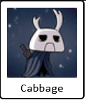

# Github Steam Stats

This project is build for fellow developers who also enjoys some PC gaming on the side. The purpose of this project is to display your steam profile, and stats of your most played games to other people as they visit your website, or your github profile. 

Currently I'm only able to get total hours played data for a user since if user's profile setting is not public then you can't request data such as last played games or achievements. 

### Where to find your steam id

Open your steam client, and go to top right where you see your profile icon and your steam wallet ballance, click it and a dropdown should open. 
Click on Account Details, and you should see your steam id on the top left. 

# Demo :chess_pawn:

### Most Played Games Card 


#### API

```
https://githubsteamstats.herokuapp.com/api/getOwnedGames/<steam_id>
```

#### Markdown usage

copy and paste the following code to your to a markdown to list your top most played games from steam
```

```

#### HTML usage

```
">
```

### Player Profile Card



#### API

```
https://githubsteamstats.herokuapp.com/api/getPlayerSummaries/<steam_id>
```

#### Markdown usage

copy and paste the following code to your to a markdown to show your steam profile
```

```

#### HTML usage

```
">
```

# API Parameters :bulb:

### Common for both cards

| parameter name | default value | description  |
|---|---|---|
| bgColor  | ffffff | any hex value, do not include hashtag |
| textColor | 000000 |  any hex value, do not include hashtag |
| borderColor  | 000000 | any hex value, do not include hashtag |
| borderWidth | 2 |  interger |

### Most Played Games Card 
| parameter name | default value | description  |
|---|---|---|
| limit  | 6 | interger less than 12 |
| row | 1 | interger |
| col  | 6| interger |

### example cards with differnt style


# Hosting :electric_plug:

You can host this application using any services or platforms that supports Docker

Use the dockerfile to build the image and run the container with the required env variables from the .env.template

API_KEY environment variable can be created using Steam Developer account
# Development :computer:

This project is built with Fastapi, and it uses the Steam API to get all Steam related data. If you are interested in contributing to this project, please fork the repo and start a PR. 

# Steam Api Documentation
[](https://developer.valvesoftware.com/wiki/Steam_Web_API)
